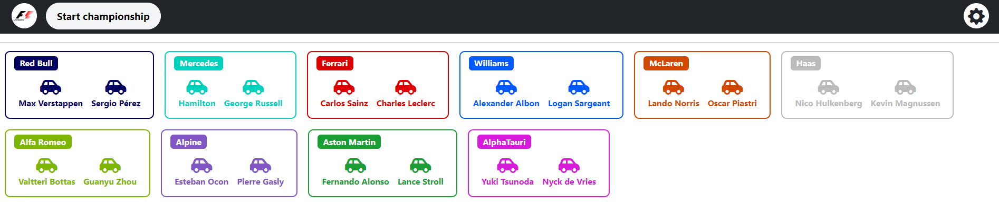
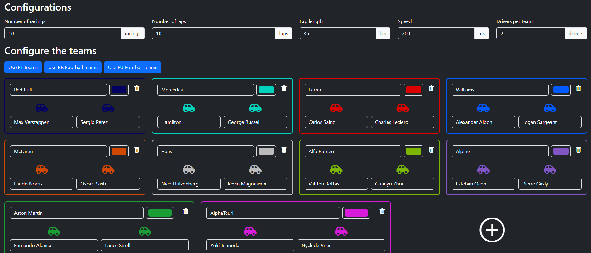
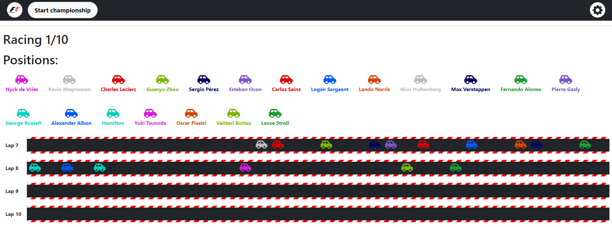
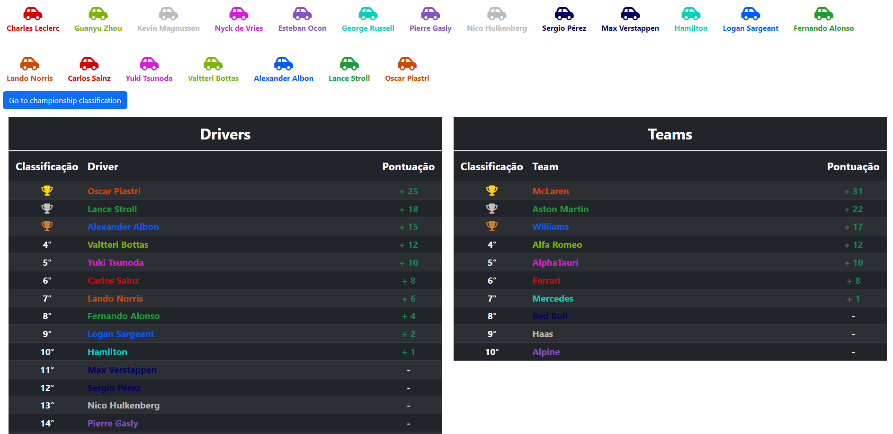
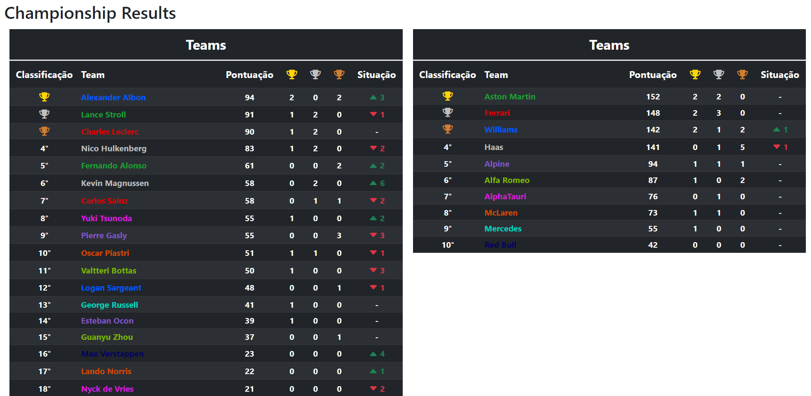

# Racing Simulator

This project simulate a racing championship and was develop using React and Typescript

[Click here](https://racing-simulator-fronchak-projects.vercel.app) to go to the project page 

## Requirements
* Node 18
* Npm 9.8

## How to Use
1. Clone this project to your machine
2. Open your terminal in the project's folder
3. Run the following command 'npm install' to install all the dependencies
5. Run 'npm run dev' to initialize the project
6. Open your browser in the 'http://localhost:5173' to see the initial page

## Images

### Drivers

### Racing Configuration

### Racing

### Racing Results

### Championship Results
